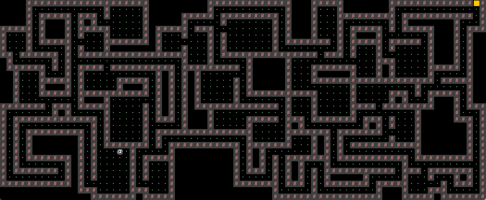
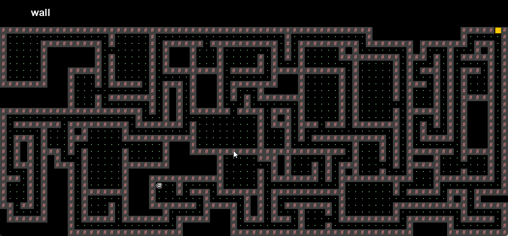

## Introduction

[Project 2: CS61BYoG](https://sp18.datastructur.es/materials/proj/proj2/proj2) is the third project (there is Project 0) in [CS 61B Data Structures, Spring 2018](https://sp18.datastructur.es/index.html). Its specific theme is **Large Scale Design and Testing**.[^1] As described in the material, the task is to create an engine for generating explorable worlds — that is, to design and implement a 2D tile-based game.

> By "tile-based", we mean the world for your game will consist of a 2D grid of tiles. By "game" we mean that the player will be able to walk around and interact with the world.[^2]

Let's say, a minimal roguelike game would meet the requirement, so I add an 'R' to **BYoG**; that is, **Build Your Own Roguelike Game**. Here I would like to talk about my solution briefly.

## World Generation

The first goal of the project will be to write a world generator. The world will be pseudorandomly generated, including rooms and hallways, drawn using the tile engine provided. My final version will be as the image shown below. Not much surprise, but that's what will cost 80% of the time in this project. You may say project 2 is about **World Generation Algorithm**.


_random map example_

### Overview

So I started googling for cool world generation algorithms and found [Rooms and Mazes: A Procedural Dungeon Generator](https://journal.stuffwithstuff.com/2014/12/21/rooms-and-mazes/), an article about generating dungeons in roguelike games, by Bob Nystrom. In summary:

> 1.  Place a bunch of random non-overlapping rooms.
> 2.  Fill in the remaining solid regions with mazes.
> 3.  Connect each of the mazes and rooms to their neighbors, with a chance to add some extra connections.
> 4.  Remove all of the dead ends.[^3]

I have to say it quite matches the [requirements](https://sp18.datastructur.es/materials/proj/proj2/proj2#:~:text=The%20requirements%20for%20your%20world%20are%20listed%20below%3A), and its [implementation](https://github.com/munificent/hauberk/blob/db360d9efa714efb6d937c31953ef849c7394a39/lib/src/content/dungeon.dart) is pretty fancy and neat. So I rewrote it in Java with minor modifications. My contribution seems minimal, but I thought it would be worth writing down and going into a few details, including three critical steps: `addRooms`, `growMaze`, then `connectRegions`.

### addRooms

Starting with a 2D grid of WALL tile filled map, it first calls `addRooms`: Do a `numRoomTries` of attempts to place rooms. In each loop, it first creates a room with random width, height and position. Then checks if this room overlaps an existing one. If so, skip it; otherwise, dig it out, i.e. fill in the FLOOR tile.

### growMaze

It then iterates every tile in the map and performs `growMaze` — a flood fill algorithm, where it could be. This resulted in the rest of the map being filled with mazes. Here, it is worth mentioning that as the maze incrementally grows from one tile to the next, it requires polling the current tile's four directions, up, right, down, and left, every time. The trick to this is the preset `CARDINALS`:

```java
public static final Position[] CARDINALS = new Position[] {
    new Position(1, 0),
    new Position(0, 1),
    new Position(-1, 0),
    new Position(0, -1)
}

public Position turn(Position dir) {
    return new Position(this.x + dir.x, this.y + dir.y);
}
```

```java
for (Position dir : Position.CARDINALS) {
    newPos = oldPos.turn(dir);
    ...
}
```

### connectRegions

After filling in the rooms and mazes, find connections between them. We treat each region of tiles as a single vertex and each connector as an edge between them,[^3] and then it is all about finding a spanning tree:

`connectRegions` first creates a list of tiles (`connectors`) that can connect two or more regions and a map (`merged`) that keeps track of all merged regions, as well as a set of unconnected regions (`openRegions`). Then, it keeps connecting regions and updating the `openRegions` until it is down to one.

The process is pretty straightforward:

> 1. Pick a random room to be the main region.
> 2. Pick a random connector that touches the main region and open it up.
> 3. The connected region is now part of the main one. Unify it.
> 4. Remove any extraneous connectors.
> 5. If there are still connectors left, go to #2.[^3]

All that remains is to make a few more tweaks. Remove all of the dead ends and inner walls, place an exit and one player, then we're good to go. And I think I will stop here.

## Interactivity

> In the second phase of the game, you'll add the ability for the user to actually play the game, and will also add user interface (UI) elements to your game to make it feel more immersive and informative.[^2]

### Game UI Appearance

The game uses the provided TileEngine, which makes heavy use of StdDraw, for displaying graphics. When the game runs with `Core.Game.playWithKeyboard()` method, it displays the menu with three options as shown below.


_game menu_

We may press N for "New Game" or L for "Load Game", and the game start. The user interface consists of a 2D grid of tiles showing the current state of the world and a HUD that displays the description of the tile under the mouse pointer. And that's it, without any unnecessary clutter or confusion.


_game UI_

### Game UI Behavior

The game begins, and we can be in control of the '@' character to move up, left, down and right using the W, A, S, and D keys, respectively. That's how we interact with the world. Here we use `StdDraw` to handle user input:

```java
private char solicitInput() {
    while (true) {
        if (StdDraw.hasNextKeyTyped()) {
            return Character.toUpperCase(StdDraw.nextKeyTyped());
        }
    }
}
```

The game mechanics is that users win by moving the '@' character to a golden colored WALL tile representing the exit, without touching the wall along the way. There are no additional bells or whistles; I believe that's all it needs to function correctly.

### Saving and Loading

> Your game must have the ability to save the game while playing and load the game in the exact state of the most recent save after quitting and opening the game back up.[^2]

The technique to accomplish this is the Java interface `Serializable`. What it does is basically translate a data structure or object state into a format that can be stored or transmitted. Implementing the interface marks the class as "okay to serialize", and Java then handles serialization internally.[^4]

```java
public class MapGenerator extends StageBuilder { ... }
public class Position extends StageBuilder { ... }
public class Room extends StageBuilder { ... }
public class Player extends StageBuilder { ... }
```

```java
abstract class StageBuilder implements Serializable {
    private static final long serialVersionUID = 1234567890L;
    ...
}
```

### Pseudorandom

Another critical topic of this project is pseudorandom. By pseudorandom, it means that the world generated, given a different seed, did vary greatly; but for a certain seed, it is deterministic.

The `Random` object would work; it is guaranteed to output the same sequence of numbers, which is completely determined by an initial seed. And the same sequence of numbers determines the width, height and location of the rooms, how twists and turns the maze is, and every single connector. Thus, the world should yield exactly the same.

## End

That's my naive solution; you may grab the code [here](https://github.com/reiuyuu/cs61b-sp18/tree/main/proj2/byog). I am pretty aware that the game I built doesn't look nice or fun. Nonetheless, project 2 is not about games; what really matters is, as mentioned in the material:

> The goal of this project is to teach you how to handle a larger piece of code with little starter code in the hopes of emulating something like a product development cycle.[^2]

[^1]: [About | CS 61B Spring 2018](https://sp18.datastructur.es/about.html)
[^2]: [Project 2: CS61BYoG | CS 61B Spring 2018](https://sp18.datastructur.es/materials/proj/proj2/proj2)
[^3]: [Rooms and Mazes: A Procedural Dungeon Generator - journal.stuffwithstuff.com](https://journal.stuffwithstuff.com/2014/12/21/rooms-and-mazes/)
[^4]: [Serialization - Wikipedia](https://en.wikipedia.org/wiki/Serialization)
